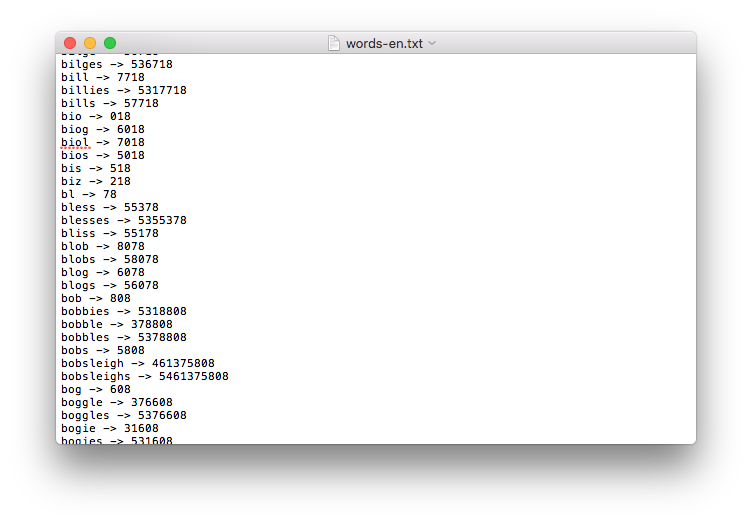

[](https://travis-ci.org/paulknewton/calculator-words)
[](https://codecov.io/gh/paulknewton/calculator-words)
[](https://pyup.io/account/repos/github/paulknewton/calculator-words)
[](https://pyup.io/account/repos/github/paulknewton/calculator-words)

[](https://deepsource.io/gh/paulknewton/calculator-words/?ref=repository-badge)

# Calculator Words
Find words that can be entered on a calculator (by turning the calculator upside down)

My son recently won a basic calculator from the lcoal Fair. We had a lot of fun entering some numbers and showing him how it would read like a word when you turned the calculator upside down. It took me back to my youth!

We looked on the internet for a few other examples words (including some rude ones of course!). But it crossed my mind that this would be the sort of thing that could easily be automated. So here it is:



This is written in Python because i) it is an elegant language; and ii) it has good support for Sets and other collections which is what I needed; and iii) I was pretty sure I could get the main algorithm down to a really short and concise set of set operations (which I did).

It starts with a dictionary (in the Python sense) of the valid letters that a calculator can reproduce. Let's call this our 'calculatorLetters'. These are the letters that can be represented by entering digits and rotating the calculator screen:

```
calculatorLetters = {
'o':'0',
'l':'1',
'i':'1',
'z':'2',
'e':'3',
'h':'4',
's':'5',
'g':'6',
'l':'7',
'b':'8'
}
```

The basic algorithm is to read through each word in the dictionary (I use the UNIX 'aspell' dictionary but any input word list will do) and see if this is can be encoded on our calculator. This is done by converting the candidate word to a set (i.e. discard any repeating letters, and we don't care about the order either).

```
# return the digits required to show the word (in reverse order)
def encode(x):
    return x.translate(str.maketrans(''.join(calculator_letters.keys()), ''.join(calculator_letters.values())))[::-1]
```

We then check if this is a subset of our encodable characters. If it is a subset, we know we can encode each letter. If there is even 1 letter that doesn't belong to our set of calculator letters then it isn't going to work and we move on the next word.

```
# can a word be encoded on a calculator?
def is_encodable(x):
    s1 = set(x);
    s2 = set(calculator_letters.keys());
    return s1.issubset)
```

If we do find words that will work on our calculator, all that is left is to encode the word as a series of numbers (by looking up each letter in our 'calculatorLetters' map) and print it to the screen (remember the digits need to reversed...)

I've included a list of words that I could find using my english, french and german dictionaries (words-en.txt, words-fr.txt, words-de.txt). Once I had the lists, I manually edited them down to only keep words that would make sense for my son.

Overall, it isn't a complex program, but it gave me a refresher in Python (dictionaries, sets etc) and it is very satisfying to see how short and elegant the program can be in Python. Long live functional programming!


The program reads possible words from the standard input. You can type in some random words to see it in action:

```
$ python calc_words.py 
hello
hello -> 07734
goodbye
```

To run the program using a dictionary as input (assuming you have 'aspell' and 'unaccent' installed):

```
aspell -d fr dump master | aspell -l fr expand | unaccent ISO-8859-1 | python calc_words.py | sort
```

Note how this uses the 'expand' feature of aspell to list all variations of words so we get the maximum amount of combinations, and also strips out any messy accented characters using the 'unaccent' program (you won't need this for English words, but you will for French and German, otherwise the list of matching words starts to shrink too much). If you have another dictionary - or just a list of words in a file - you can pipe any content into the program. I don't assume a new word per line either - it anyway splits the input lines into separate words.

Some unit tests packaged as well. Just run these with pytest.

Have fun!
